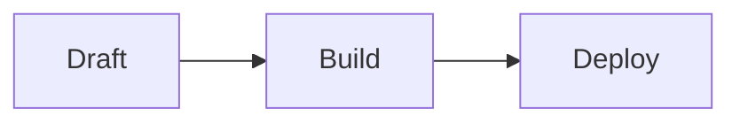

# Adding Blog Posts

Blog posts live in `src/content/blog`.

Create one file per post. Use a lowercase kebab-case filename because the filename becomes the
public slug.

```text
src/content/blog/my-new-post.md
```

That file publishes at:

```text
https://boredatthemoment.github.io/latent-margins/blog/my-new-post/
```

## File Format

Use `.md` for normal Markdown. Use `.mdx` only when the post needs MDX features, such as imported
Astro components or JSX-like markup.

Every post needs frontmatter at the top:

```md
---
title: "My New Post"
description: "A short summary for the blog index and page metadata."
pubDate: 2026-05-15
tags: ["notes", "engineering"]
draft: false
---

Write the post body here.

## A Section

Normal Markdown works.
```

Required fields:

- `title`
- `description`
- `pubDate`
- `tags`
- `draft`

Optional fields:

- `author`
- `updatedDate`
- `citations`

Set `draft: true` while writing. Draft posts are ignored by the blog index and the generated post
routes.

## Citations

Posts can include citation metadata:

```yaml
citations:
  - id: astro-content
    title: Astro Content Collections
    authors: Astro Docs
    year: 2026
    url: https://docs.astro.build/en/guides/content-collections/
```

Then reference the citation in the post body:

```md
Astro content collections provide typed Markdown content [@astro-content].
```

The article layout turns citation references into numbered links and renders the citation rail.

## Diagrams And Code

Mermaid code fences render as diagrams:

````md

````

Regular fenced code blocks are syntax-highlighted by Astro.

## After Adding Or Editing A Post

Run the local checks:

```bash
npm run build
```

For the full repository checks, including Python content validation:

```bash
npm run check:all
```

Commit and push to `main`. GitHub Actions builds the Astro site and deploys `dist` to GitHub Pages.

The live site is:

```text
https://boredatthemoment.github.io/latent-margins/
```
