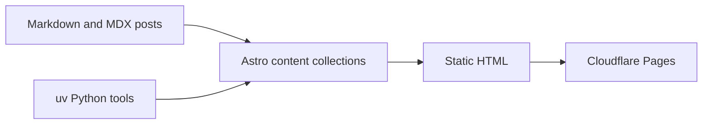

Technical blogs work best when the writing format stays plain, the output is fast, and richer
explanations can appear exactly where they help. Astro content collections give the site a typed
Markdown layer [@astro-content], while uv keeps the Python-side tooling fast and reproducible [@uv].

## Build Flow



## Python Tooling

The site can stay static while Python handles validation and publishing chores at build time.

```python
from pathlib import Path

POSTS = Path("src/content/blog")

def slugs() -> list[str]:
    return sorted(path.stem for path in POSTS.glob("*.mdx"))
```

That split keeps hosting simple and makes the authoring workflow pleasant.
